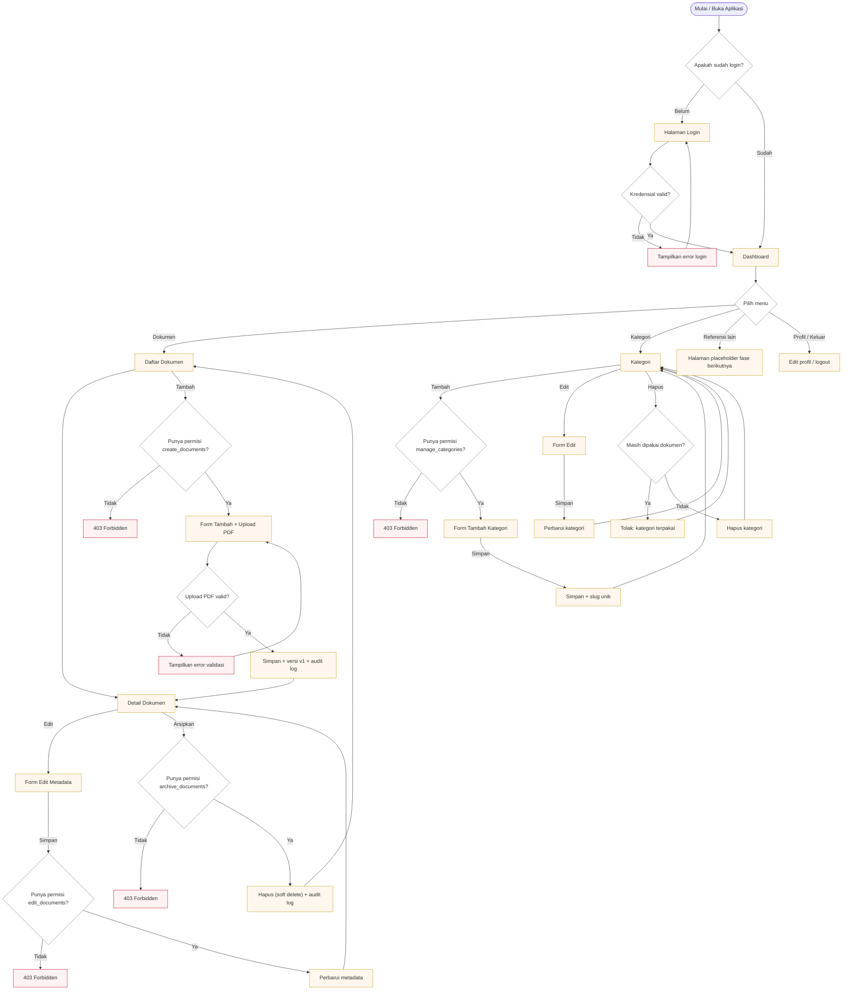
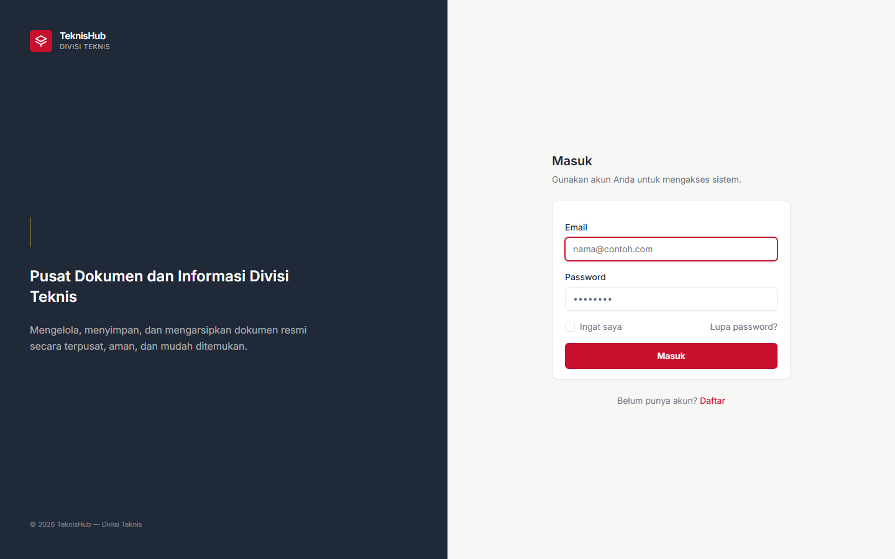
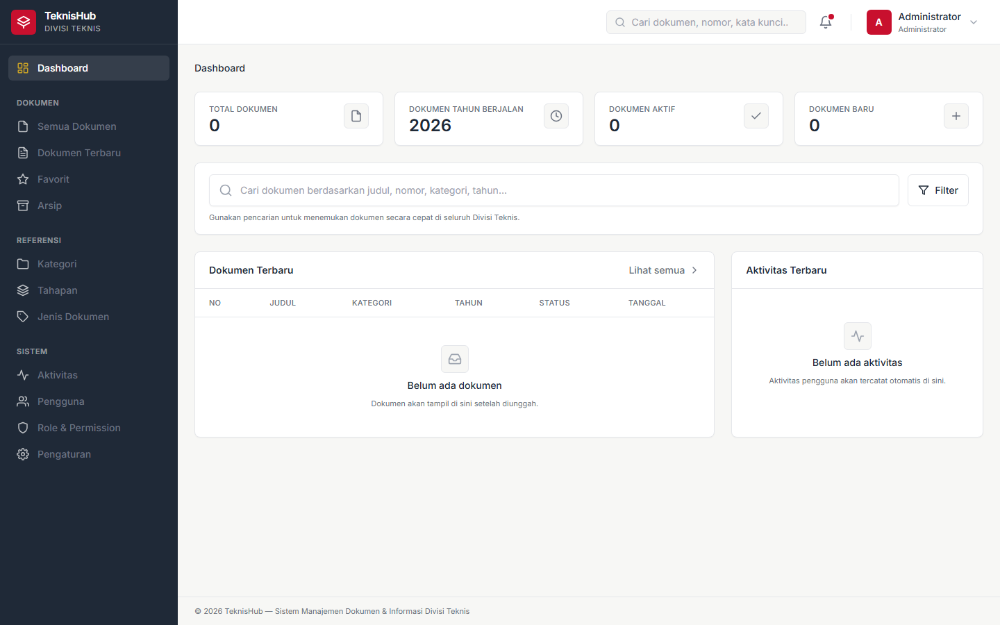

# TeknisHub

**Sistem Manajemen Dokumen & Informasi Divisi Teknis**

Pusat Dokumen dan Informasi Divisi Teknis — aplikasi untuk mengelola, menyimpan,
mencari, dan mengarsipkan dokumen resmi secara terpusat, aman, dan mudah ditemukan.

---

## Gambaran Umum

TeknisHub dibangun sebagai sistem dokumentasi internal Divisi Teknis KPU (Kabupaten)
dengan fokus pada kejelasan, konsistensi, kegunaan, aksesibilitas, arsitektur
informasi, performa, dan keamanan.

Desain mengadopsi warna khas KPU (merah `#C8102E`, putih, abu-abu netral) dengan
aksen emas `#C9A227`, tanpa gradien maupun efek dekoratif berlebihan.

### Status Pengembangan

Project dikerjakan secara bertahap. Saat ini berada pada **Fase 3 (Document Management, Upload & Metadata)**:

### Fase 1 (Foundation)
- [x] Setup Laravel + MySQL + Authentication
- [x] Base layout TeknisHub (sidebar, topbar, content area)
- [x] Design system (warna KPU, tipografi, komponen)
- [x] Skeleton Dashboard
- [x] Navigasi responsive (drawer pada mobile)
- [x] Migration dasar + seeder roles/permissions/admin

### Fase 2 (Database Architecture & Core Data Model)
- [x] Skema database dokumen (jenis, kategori, tahapan, dokumen, versi, favorit, audit, setting)
- [x] Enum nilai status & akses dokumen (Draft/Aktif/Diubah/Tidak Berlaku/Diarsipkan; Internal/Terbatas/Publik)
- [x] Model Eloquent + relasi lengkap (polimorfik audit, hierarki tahapan, soft delete dokumen)
- [x] Seeder terpisah (permission, role, jenis dokumen, kategori, tahapan, setting)
- [x] Factory untuk pengujian & data dummy

### Fase 3 (Document Management, Upload & Metadata)
- [x] Document CRUD (list, detail, create, edit, archive/soft-delete)
- [x] Upload PDF (MIME + size validation, secure filename, private storage)
- [x] Metadata lengkap + validasi server-side (Form Request)
- [x] Private file storage (`storage/app/private`, tanpa URL publik langsung)
- [x] Otorisasi via `DocumentPolicy` + permission Phase 2
- [x] Audit log (create/update/archive)
- [x] Listing: pagination, sorting (whitelist), filter dasar (tahun/kategori/jenis/tahapan/status), pencarian deskriptif sederhana
- [x] Versi awal (v1) dibuat saat dokumen baru; manajemen versi → Fase 6
- [ ] Fase 4+: pencarian lanjutan, preview & download aman, versioning, arsip penuh

---

## Alur Aplikasi (Flowchart)

Diagram di bawah menggambarkan alur utama pengguna dalam TeknisHub — mulai dari
autentikasi, navigasi, hingga manajemen dokumen dan kategori.



### Keterangan alur

1. **Autentikasi** — Halaman `/` mengarahkan ke login bila belum masuk. Setelah masuk, pengguna mendarat di Dashboard.
2. **Otorisasi** — Setiap aksi CRUD diperiksa lewat `Policy` + `Permission`:
   - Dokumen: `view_documents`, `create_documents`, `edit_documents`, `archive_documents`
   - Kategori: `manage_categories`
   - Tanpa permisi → respons `403 Forbidden` dan tombol disembunyikan via `@can(...)`.
3. **Upload PDF** — Dipvalidasi (MIME `application/pdf` + ukuran maks) sebelum disimpan ke `storage/app/private`. Versi awal (v1) dan audit log dibuat dalam satu transaksi.
4. **Hapus kategori** — Ditolak bila masih digunakan oleh dokumen.
 5. **Arsip dokumen** — Menggunakan soft delete; file fisik tidak dihapus sehingga dokumen tetap dapat dipulihkan.

---

## Tampilan Aplikasi

| Halaman Login | Dashboard |
|---|---|
|  |  |

---

## Requirements

- PHP **^8.2** (direkomendasikan 8.2+)
- Composer 2.x
- MySQL / MariaDB 10.4+
- Node.js 20+ & npm (untuk asset Vite)

---

## Installation

```bash
# 1. Clone / salin project ke web server (mis. XAMPP htdocs)

# 2. Install dependensi PHP
composer install

# 3. Install dependensi frontend
npm install

# 4. Salin file environment
cp .env.example .env

# 5. Generate application key
php artisan key:generate

# 6. Siapkan database MySQL
```

## Environment

Salin `.env.example` menjadi `.env` lalu sesuaikan. Konfigurasi penting:

```dotenv
APP_NAME=TeknisHub
APP_ENV=local
APP_KEY=
APP_DEBUG=true
APP_URL=http://localhost

DB_CONNECTION=mysql
DB_HOST=127.0.0.1
DB_PORT=3306
DB_DATABASE=teknishub
DB_USERNAME=root
DB_PASSWORD=

# Admin awal (khusus development, JANGAN untuk produksi)
ADMIN_EMAIL=admin@teknishub.test
ADMIN_PASSWORD=password
ADMIN_NAME=Administrator
```

> **Keamanan**: Ubah `ADMIN_PASSWORD` dan selalu gunakan environment variable.
> Jangan pernah menaruh password produksi secara hardcoded.

## Database Setup

```bash
# Pastikan MySQL aktif, lalu buat database
CREATE DATABASE teknishub CHARACTER SET utf8mb4 COLLATE utf8mb4_unicode_ci;

# Jalankan migration
php artisan migrate

# Jalankan seeder (permission, role, master data, admin, setting)
php artisan db:seed
```

Untuk membangun ulang dari awal saat development:

```bash
php artisan migrate:fresh --seed
```

## Storage Setup

Dokumen internal disimpan pada filesystem `local` (privat, tidak berada di direktori
publik). Jalankan symlink storage untuk asset publik bila diperlukan:

```bash
php artisan storage:link
```

## Menjalankan Development

```bash
# Terminal 1 — Vite dev server
npm run dev

# Terminal 2 — Aplikasi Laravel
php artisan serve
```

Akses aplikasi di `http://localhost:8000`. Login admin default (development):
`admin@teknishub.test` / `password`.

## Build

```bash
# Build asset untuk produksi
npm run build
```

## Testing

Aplikasi menggunakan PHPUnit. Konfigurasi `phpunit.xml` memakai SQLite in-memory
agar tidak mengganggu data development.

```bash
php artisan test
# atau
vendor/bin/phpunit
```

Ruang lingkup test saat ini: authentication (Breeze), RBAC seeder, render dashboard,
relasi database (dokumen↔kategori/jenis/versi, favorit unik, audit polimorfik,
hierarki tahapan, soft delete), dan manajemen dokumen (CRUD, otorisasi Viewer/Operator/Admin,
upload/validasi PDF).

Lihat `docs/database.md` untuk dokumentasi skema database lengkap.

## Module Dokumen (Fase 3)

Routes (resource `documents`):

| Method | URI | Nama | Deskripsi |
|---|---|---|---|
| GET | `/documents` | documents.index | Daftar + filter + pencarian + pagination |
| GET | `/documents/create` | documents.create | Form tambah |
| POST | `/documents` | documents.store | Simpan + upload + versi awal |
| GET | `/documents/{document}` | documents.show | Detail + info file |
| GET | `/documents/{document}/edit` | documents.edit | Form edit metadata |
| PUT | `/documents/{document}` | documents.update | Simpan perubahan |
| DELETE | `/documents/{document}` | documents.destroy | Arsip (soft delete) |

### Konfigurasi upload (env)

```dotenv
# Maksimum ukuran upload dalam KB (default 20 MB)
DOCUMENT_MAX_UPLOAD_KB=20480

# Disk penyimpanan privat untuk dokumen
DOCUMENT_DISK=local
```

File disimpan privat pada `storage/app/private/documents/{tahun}/{uuid}.pdf`; nama
asli disimpan di `document_versions.original_filename`. Tidak ada URL publik
langsung ke file dokumen.

## Deployment

Aplikasi mendukung berbagai environment:

- **XAMPP / Laragon** — letakkan folder project pada direktori web server.
- **Linux VPS / shared hosting** — arahkan document root ke folder `public/`.

Langkah produksi umum:

```bash
composer install --optimize-autoloader --no-dev
php artisan config:cache
php artisan route:cache
php artisan view:cache
php artisan migrate --force
npm install && npm run build
```

## Struktur Direktori Utama

```
app/Http/Controllers/   Controller (termasuk PageController placeholder)
app/Models/             Model (User, Role, Permission, ...)
database/migrations/    Skema database
database/seeders/       Seeder (roles, permissions, admin)
resources/css/          Desain system (warna KPU, komponen Tailwind)
resources/js/           Alpine.js
resources/views/        Layout, komponen Blade, halaman
routes/web.php          Definisi route
```

## Security Notes

- Autentikasi & otorisasi server-side (middleware, policy, gate).
- Password di-hash menggunakan mekanisme Laravel.
- Validasi input, CSRF, XSS, dan SQL injection protection bawaan Laravel.
- File dokumen internal disimpan privat (`storage/app/private`) dan hanya diakses
  lewat controller terotorisasi; tidak ada URL publik langsung.
- Validasi upload PDF menolak non-PDF dan file berukuran melebihi batas konfigurasi.
- Tidak ada data sensitif atau secret yang dicatat ke audit log / log.

## Roadmap

- **Fase 2** — ✅ Arsitektur database dokumen (kategori, tahapan, jenis, versi, favorit, audit) — selesai.
- **Fase 3** — ✅ Manajemen dokumen (CRUD, upload, metadata, validasi, storage, otorisasi) — selesai.
- **Fase 4** — Pencarian & filter.
- **Fase 4** — Pencarian & filter.
- **Fase 5** — Preview & download dengan otorisasi.
- **Fase 6** — Versioning & arsip.
- **Fase 7** — Manajemen pengguna, role, permission, policy.
- **Fase 8** — Dashboard statistik.
- **Fase 9–11** — Penyempurnaan UI/UX, keamanan, dan kesiapan produksi.
```
